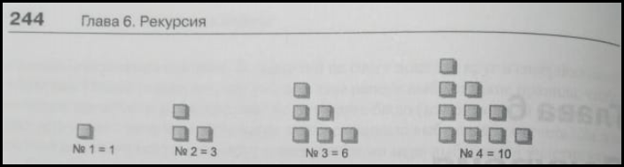
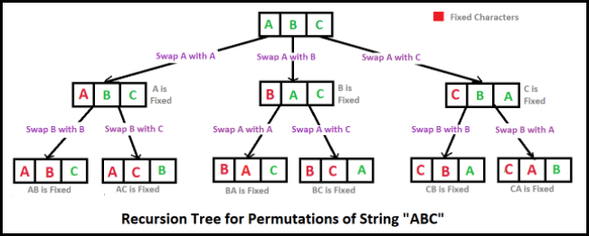
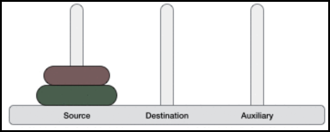

# <a id="home"></a> Recursion

**Table of Contents:**
- [Что такое рекурсия?](#idea)
- [Треугольные числа](#triangle)
- [Ханойская башня](#hanoi)
- [Merge Sort](#mergesort)
----

## [↑](#home) <a id="idea"></a> Что такое рекурсия?
Рекурсия - это использование чем-то самого себя. Идея рекурсии применяется как в алгоритмах (метод вызывает такой же метод, но с другими параметрами), так и в структурах данных (структура состоит из таких же структур).

В основе рекурсивных алгоритмов лежит два понятия:
- Базовый случай (**base case**)
Описывает условие для выхода из рекурсии
- Шаг рекурсии (**recursive step**)
Описывает следующий рекурсивный вызов

Вооружимся онлайн Java компилятором, таким как [onecompiler.com](https://onecompiler.com/) или [rextester.com](https://rextester.com/l/java_online_compiler).

Пример рекурсии: дано натуральное число n и нам нужно вывести все числа от 1 до n:
```java
public static String recursion(int n) {
    // Базовый случай
    if (n == 1) {
        return "1";
    }
    // Шаг рекурсии / рекурсивное условие
    return recursion(n - 1) + " " + n;
}
```

Как видно, чтобы решить задачу рекурсивно нужно разбить её не подзадачи. Таким образом поиск всех натуральных чисел для n - это сумма n и результата поиска всех натуральных чисел для n-1.

Про рекурсию хорошо написано в статье на хабре: **"[Рекурсия. Занимательные задачки](https://habr.com/ru/post/275813/)"**.


## [↑](#home) <a id="triangle"></a> Треугольные числа
Знакомство с рекурсией часто начинается с факториалов, но мне понравился пример из книги Роберта Лафоре **"[Структуры данных и алгоритмы в Java](https://www.bookvoed.ru/book?id=2652862)"**. Знакомство с рекурсией можно начать с такой вещи, как **"Треугольные числа"**.

Раньше, в древние времена, когда люди постигали математику и считали выкладывая камешки, люди заметили, что определённая последовательность чисел образуют треугольник:



C чисто арифметической точки зрения, n-е треугольное число — это сумма n первых натуральных чисел:
```java
public static int getTriangleNumber(int number) {
    int sum = 0;
    for (int i = 1; i <= number; i++) {
        sum = sum + i;
    }
    return sum;
}
```

К решению данной задачи можно подойти и иначе. Можно заметить, что каждое треугольное число - это сумма порядкового номера текущего числа и значения предыдущего треугольного числа. Таким образом третье треугольное чилос = 3 + второе треугольное число. Второе треугольное число = 2 + первое треугольное число. Первое треугольное число = 1.
Тогда задачу можно решить при помощи рекурсии:
```java
public static int getTriangleNumber(int number) {
    if (number == 1) {
        return 1;
    }
    return number + getTriangleNumber(number - 1);
}
```
В плане применимости можно представить, что у нас есть конфеты размером 2х2 см. Вкуснейшие трюфели. Мы хотим их разместить в коробки по несклько штук, но чтобы коробки не были очень большими. Нужно прикинуть размер стороны коробки. Можно прикинуть кол-во конфет по одной стороне коробки, чтобы это не было слишком громоздко. Например, 4 кофеты * 2 см = 8 см. Кажется вполне себе небольшая подарочная упаковка. А зная значение треугольного числа мы знаем, что в такую коробку поместится 10 конфет. Останется только по теореме Пифагора вычислить гипотенузу прямоугольного треугольника, т.е. извлечь квадратный корень из суммы квадратов катетов. А их размер мы вычислили.

Вычисление факториала - тоже самое, что и вычисление треугольного числа, только вместо суммы мы будем вычислять произведение:
```java
public static int getFactorial(int number) {
    if (number == 0) {
        return 1;
    }
    return number * getFactorial(number - 1);
}
```
Допустим, пользователь вводит pin длинной в n уникальных знаков. Тогда можно показать, сколько нужно перебрать комбинаций, чтобы взломщик смог подобрать pin. Например, для 4-ёхзначного pin'а это будет всего лишь 24 комбинации.

Сюда же можно отнести задачу вычисления чисел Фибоначчи. Подробнее можно прочитать в статье на хабре: **"[пять способов вычисления чисел Фибоначчи](https://habr.com/ru/post/261159/)"**.


## [↑](#home) <a id="anagramm"></a> Анаграммы
Анаграммы - это слова, составленные из одного набора букв. И для построения анаграмм можно в том числе использовать рекурсивный алгоритм.

Пример рекурсии для получения анаграмм приводится и в книге **"[Структуры данных и алгоритмы в Java](https://www.bookvoed.ru/book?id=2652862)"**, но он мне не нравится за свою непрозрачность. Мне гораздо больше понравился вариант: **"[Generate all permutations of a string in Java](https://www.techiedelight.com/generate-permutations-string-java-recursive-iterative)"**.

Нам понадобится вспомогательный метод swap, который меняет элементы местами:
```java
private static void swap(char[] ch, int i, int j) {
    char temp = ch[i];
    ch[i] = ch[j];
    ch[j] = temp;
}
```

Тогда, рассмотрим логику работы алгоритма по схеме:




А сам рекурсивный метод выглядит следующим образом:
```java
private static void permutations(char[] ch, int currentIndex) {
    if (currentIndex == ch.length - 1) System.out.println(String.valueOf(ch));

    for (int i = currentIndex; i < ch.length; i++) {
        swap(ch, currentIndex, i);
        permutations(ch, currentIndex + 1);
        swap(ch, currentIndex, i);
    }
}
```


## [↑](#home) <a id="hanoi"></a> Ханойская башня
Алгоритмы не только разминка для мышления, но и отличная тренировка для декомпозиции задачи. И отличный пример рекурсии и декомпозиции - задача о Ханойской Башне. 

**Ханойская башня** - это задача про три стержня или колышка. На одном из колышков расположены кольца. Кольца имеют разный размер и сложены в порядке возрастания (т.е. меньшее помещается над большим).

Правила, которым нужно следовать для Ханойской башни:
- Только один диск может быть перемещен среди башен в любой момент времени.
- Только «верхний» диск может быть удален.
- Ни один большой диск не может сидеть над маленьким диском.

Допустим, нужно решить данную задачу для трёх дисков. Но решение для трёх дисков по сути состоит и решения для двух дисков, которое по сути состоит из решния для одного диска.

Итак, пометим колышки как S - Source, D - Destination, I - Inner (Auxiliary, т.е. вспомогательный).



Чтобы лучше понять, как это работает есть три момента:
- Проделать визуально на какой-нибудь симуляции на сайте вроде [webgamesonline](https://www.webgamesonline.com/towers-of-hanoi/index.php)
- Разделить колышки на "надо сюда" и "вспомогательный"
- Помнить, что "надо сюда" и "вспомогательный" не одинаковы для каждого перемещения

Самый простой случай - 2 диска. Чтобы переместить второй диск (n=2) в положение "куда хотим" (на колышек D), то нам нужно сначала переместить предыдущий диск (n-1) в положение "вспомогательный". Случай n-1 является случай перемещением одного диска. Далее возвращаемся к диску n. Перемещаем его в положение "куда хотим", после чего перемещаем на него n-1.
Стоит заметить что любое перемещение - это перемещение всех предыдущих колец.

Таким образом, решение получается на удивление коротким:
```java
public static void doTowers(int topN, char from, char inner, char to) {
    if (topN == 1) {
        System.out.println("Disc #1 from " + from + " to " + to);
    } else {
        doTowers(topN - 1, from, to, inner); // from -> inner
        System.out.println("Disc #" + topN + " from " + from + " to " + to);
        doTowers(topN - 1, inner, from, to); // inner --> to
    }
}
```

Ну и для полноты картины можно сказать, что рекурсивный подход можно превратить в итеративный (т.е. переписать через циклы). Подробнее можно прочитать в материале: **"[GeeksForGeeks: Iterative Tower of Hanoi](https://www.geeksforgeeks.org/iterative-tower-of-hanoi/)"**.


## [↑](#home) <a id="mergesort"></a> Merge Sort
Рекурсия может применяться и для сортировок. И отличный пример - сортировка слияниям.

**Merge Sort** - это сортировка, при которой изначальный набор делится пополам, эти половинки сортируются, а потом склеиваются. Каждая половинка сортируется по тем же правилам. Делить не надо только если остался один элемент. Что похоже на базовый случай.

Для начала опишем саму идею. Так как мы рассматриваем набор элементов, то нам надо знать где начинается рассматриваемая область и где заканчивается. Для этого введём два указателя: левый (left) и правый (right).

Тогда опишем для начала требования: 
- Если остался один элемент (т.е. left и right сошлись) - прекращаем работу
- Нужно знать середину. left и right образуют [интервал](https://en.wikipedia.org/wiki/Interval_(mathematics)), серединой которого является (left+right)/2
- Сортируем две половины: [left, middle] и [middle+1, right]
- Объединяем две отсортированные половины так, чтобы элементы шли тоже отсортировано

```java
public static void mergeSort(int[] array, int left, int right) {
    if (left >= right) return;
    int middle = (left + right) / 2;
    mergeSort(array, left, middle);
    mergeSort(array, middle + 1, right);
    merge(array, left, right);
}
```

Осталось написать сам метод склеивания, т.е. метод merge. Интересно, что данная операция рассмотрена как отдельная задача на leetcode: "[88. Merge Sorted Array](https://leetcode.com/problems/merge-sorted-array/)".

Про итерацию мне понравилось объяснение из видео на youtube: "[Amazon Coding Interview Question - Merge Two Sorted Lists](https://youtu.be/EvgZCUhTosc?t=170)".
Для итерации нам понадобится два дополнительных указателя: i и j. Мы будем двигать указатель i, пока есть элементы в левой части, а указатель j пока есть элементы в правой части. Таким образом:
```java
while (i <= middle || j <= right ) {
}
```
Остаётся понять, как правильно переместить элементы так, чтобы они встали на правильное место. Мы должны описать условие в стиле "В этом случае мы возьмём слева, а иначе справа".
```java
public static void merge(int[] array, int leftBound, int rightBound) {
        int middle = (leftBound + rightBound) / 2;
        int left = leftBound;
        int right = middle + 1;

        int[] aux = new int[rightBound - leftBound + 1];
        for (int i = 0; i < aux.length; i++) {
            if (right > rightBound || (left <= middle && array[left] < array[right])) {
                aux[i] = array[left++];
            } else {
                aux[i] = array[right++];
            }
        }
        for (int i = 0; i < aux.length; i++) {
            array[leftBound + i] = aux[i];
        }
    }
```
Как видно, каждый раз нам нужен массив. Это в том числе позволяет нам думать, что мы выполняем слияние до тех пор, пока этот массив не заполним. Из левой части мы берём тогда, когда правая обработана или если левая часть меньше правой.

Интересно, что есть вариант реализации и без дополнительного массива. Подробнее см. **"[In-Place Merge Sort](https://www.geeksforgeeks.org/in-place-merge-sort/)"**.