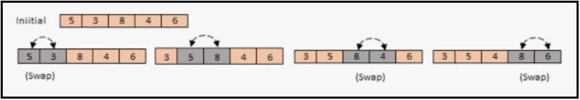
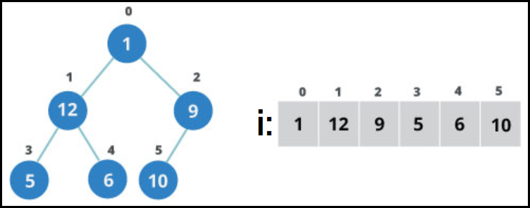

# <a id="home"></a> Sorting Algorithms

**Table of Contents:**
- [Swap](#swap)
- [Bubble sort](#bubble)
- [Selection sort](#selection)
- [Insertion sort](#insertion)
- [Shell sort](#shell)
- [Merge sort](#merge)
- [Quick sort](#quick)
- [Counting sort](#counting)
- [Radix sort](#radix)
- [Heap sort](#heap)
- [Additional Resources](#resources)
----


## [↑](#home) <a id="swap"></a> Swap
Многие сортировки основаны на обмене, он же **swap**.

Метод обмена уже реализован для коллекций: **[Collections.swap](https://docs.oracle.com/javase/8/docs/api/java/util/Collections.html#swap-java.util.List-int-int-)**.\
Для массивов нам придётся написать его самостоятельно:
```java
public void swap(int[] array, int first, int second) {
    int temp = array[first];
    array[first] = array[second];
    array[second] = temp;
}
```

Есть вариант как сделать обмен по-другому. Например, имея два числа a и b мы можем выполнить следующим действия:
```
A = A + B (сложить в одном месте оба числа)
B = A - B (в B всё ещё второе число, поэтому мы можем вычесть его из суммы и получить первое число)
A = A - B (в B теперь первое число, поэтому вычитаем из суммы его, чтоб получить второе число)
```
Ещё есть менее читабельный вариант - использовать специфику операции XOR. Более подробно можно прочитать в объяснении на stack overflow: **"[How does the XOR (^) swap algorithm work?](https://stackoverflow.com/a/21094256/6604312)"**.

## [↑](#home) <a id="bubble"></a> Bubble sort
**[Bubble sort](./src/main/java/com/github/veselroger/algo/BubbleSort.java)**, она же "Пузырьковая сортировка" или "сортировка пузырьком" - простейший алгоритм сортировки. Но он важен для последовательного понимания того, как сортировки работают.

Сортировка пузырьком основана на двух действиях: итерации по всем элементам и сравнении ближайших (**adjacent**) элементов. Если элементы стоят неправильно, то происходит обмен (**swap**). 

Сортировка выполняется проходом начиная от элемента i=0 до элемента i=n-1 (т.к. сравниваем i и i+1).\
Если i будет равен n, тогда мы вылезем за пределы массива и упадём с ошибкой. Поэтому наш цикл будет выглядеть так:
```java
for (int i = 0; i < array.length - 1; i++) {
    if (array[i] > array[i+1]) {
        swap(array, i, i+1);
    }
}
```

В результате 1 такого цикла одно значение "всплывает" к концу массива:



Таким образом, нужно повторить n раз проходов по n-1 элементам. При этом каждый проход уменьшается кол-во элементов, т.к. в конце каждого прохода "всплыл" на своё место ещё один элемент.

Выглядеть это будет так:
```java
public void sort(int[] array) {
  for (int pass = 0; pass < array.length; pass++) {
    for (int i = 0; i < array.length - 1; i++) {
      if (array[i] > array[i+1]) {
        swap(array, i, i+1);
      }
    }
  }
}
```

Можно заметить, что если массив уже отсортирован (т.е. мы не сделали ни одного swap), то мы всё равно будем впустую итерироваться. Будет полезно добавить проверку на выполненные перестановки:
```java
public void sort(int[] array) {
  for (int pass = 0; pass < array.length; pass++) {
    boolean swapped = false;
    for (int i = 0; i < array.length - 1; i++) {
      if (array[i] > array[i+1]) {
        swap(array, i, i+1);
        swapped = true;
      }
    }
    if (!swapped) break; 
  }
}
```

Для оценки эффективности алгоритма используют такое понятие, как **"[сложность алгоритма](https://habr.com/ru/post/195482/)"** или же **Time Complexity**. В случае сортировки пузырьком у нас есть два цикла, один вложенный в другой. А это значит, что time complexity в данном случае будет квадратичной, т.е. равна N^2 (N в квадрате).

Подробный обзор алгоритма: **"[Bubble Sort - Explained and Implemented](https://www.youtube.com/watch?v=F9F9TXq9Fh4&list=PLlsmxlJgn1HLCmaF51i5xAbgv1f49CsoP)"**.


## [↑](#home) <a id="selection"></a> Selection sort
**[Selection sort](./src/main/java/com/github/veselroger/algo/SelectionSort.java)** или сортировка выбором - это улучшение алгоритма сортировки пузырьком. Сортировка пузырьком по сути за каждый проход на своё место ставит один элемент, совершая при этом очень много перестановок. Цель сортировки выбором - выбрать элемент и переместить его всего 1 раз за проход.

```java
public void sort(int[] array) {
  for (int out = 0; out < array.length - 1; out++) {
    int minInd = out;
    for (int in = out + 1; in < array.length; in++) {
      if (array[in] < array[minInd]) {
        minInd = in;
      }
    }
    swap(array, out, minInd);
  }
}
```

Внешний цикл (out) проходит по элементам начиная с 0 и заканчивает размером элементов - 1. Потому что внутренний цикл (in) начинает с со следующего элемента после внешнего цикла. Внешний цикл смещается, что приводит к тому, что слева от него остаётся отсортированная часть.

Подробный обзор алгоритма: **"[Selection Sort - Explained and Implemented](https://www.youtube.com/watch?v=bIb9oX_d5qY&list=PLlsmxlJgn1HLCmaF51i5xAbgv1f49CsoP&index=2)"**.


## [↑](#home) <a id="insertion"></a> Insertion sort
**[Insertion sort](./src/main/java/com/github/veselroger/algo/InsertionSort.java)**, она же сортировка вставками - продолжение идеи простых сортировок. Если сортировка выбором выбирала нужный элемент и перемещала его в правильное место, постепенно заполняя массив в правильном порядке, то сортировка вставками для каждого элемента идёт ВЛЕВО и ищет место ДО элемента, куда его нужно поместить.

Данный алгоритм иногда сравнивают с тем, как мы сортируем купюры или карты. Мы берём нужную карту или купюру, вытаскиваем её из набора, и идём по набору влево (т.е. ищем место ДО вынутого элемента) пока не найдём правильное место.

Алгоритм вставкой можно выразить следующим образом:
```java
public void sortShort(int[] array) {
  for (int out = 1; out < array.length; out++) {
    // While 'in' has one space before && 'in' should be swapped
    for (int in = out; in > 0 && array[in] < array[in - 1]; in--) {
      swap(array, in, in - 1);
    }
  }
}
```

В более традиционном виде этот код можно записать так:
```java
public void sort(int[] array) {
  for (int out = 1; out < array.length; out++) {
    int temp = array[out]; // cut element
    int in = out; // start from 'out'
    // Move elements while they less than cutted element
    while (in > 0 && array[in - 1] >= temp) {
      array[in] = array[in - 1];
      --in;
    }
    array[in] = temp;
  }
}
```

Подробный обзор алгоритма: **"[Insertion Sort - Explained and Implemented](https://www.youtube.com/watch?v=ZUZi8HJY8kc&list=PLlsmxlJgn1HLCmaF51i5xAbgv1f49CsoP&index=3)"**.


## [↑](#home) <a id="shell"></a> Shell sort
**[Shell sort](./src/main/java/com/github/veselroger/algo/ShellSort.java)**, она же сортировка Шелла - это улучшение сортировки вставками.

Изначально, [сортировка вставками](#insertion) ищет место вставки с интервалом в 1. Сортировка Шелла - та же сортировка вставками, но интервал не 1, а вычисляемый. 

Самый простой вариант - интервал в половину массива. При этом выполняется итерация так, что этот интервал каждый раз сокращается вдвое. Таким образом внешний цикл будет выглядеть следующим образом:
```java
for (int gap = array.length; gap > 0; gap = gap / 2) {      
}
```

Теперь впишем в этот внешний цикл алгоритм сортировки вставками:
```java
public void sort(int[] array) {
    for (int gap = array.length / 2; gap > 0; gap = gap / 2) {
      for (int out = gap; out < array.length; out++) {
        int temp = array[out];
        int in = out;
        while (in >= gap && array[in - gap] >= temp) {
            array[in] = array[in - gap];
            in = in - gap;
        }
        array[in] = temp;
      }
    }
}
```

Подробный обзор алгоритма: **"[Shell Sort - Explained and Implemented](https://www.youtube.com/watch?v=IViqgakt-Eg&list=PLlsmxlJgn1HLCmaF51i5xAbgv1f49CsoP&index=4)"**.


## [↑](#home) <a id="merge"></a> Merge sort
**[Merge Sort](./src/main/java/com/github/veselroger/algo/MergeSort.java)**, она же сортировка слияниям - дальнейшее развитие идеи сортировки. Данная сортировка пример подхода "разделяй и властвуй" (**divide and conquer**).
Сортировка слияниям предполагает разбиение общей задачи сортировки на подзадачи.

Как разбить задачу на подзадачи? Для этого нужно определить середину [интервал](https://en.wikipedia.org/wiki/Interval_(mathematics)). Можно вычислить середину как ``(left + right) / 2``, а можно как ``left + (right-left)/2``. Второй вариант обычно рекомендуют как средство избежания переполнения, если значения left и right будут слишком большими.

Тогда общий алгоритм сортировки будет описан следующим образом:
```java
public void mergeSort(int[] array, int left, int right) {
    if (left >= right) return;
    int middle = (left + right) / 2;
    mergeSort(array, left, middle);
    mergeSort(array, middle + 1, right);
    merge(array, left, right, middle);
}
```
Если левый указатель зайдёт за правый или встанет на его место - значит у нас остался 1 элемент и дальше не надо ничего делать. А иначе вычислим середину и выполним сортировку для каждой из частей. После чего объединим. Интересно, что объединение может быть рассмотрено как отдельная задача (например, на leetcode есть задача "[88. Merge Sorted Array](https://leetcode.com/problems/merge-sorted-array/)").


Объединение может выглядеть следующим образом:
```java
public void merge(int[] array, int leftBound, int rightBound, int middle) {
    int left = leftBound;
    int right = middle + 1;

    int[] aux = new int[rightBound - leftBound + 1];
    for (int i = 0; i < aux.length; i++) {
        if (right > rightBound || (left <= middle && array[left] < array[right])) {
            aux[i] = array[left++];
        } else {
            aux[i] = array[right++];
        }
    }
    for (int i = 0; i < aux.length; i++) {
        array[leftBound + i] = aux[i];
    }
}
```
При итерации по половинкам удобно ориентироваться на размер вспомогательного массива aux, т.к. мы работаем пока не пройдём от первого до последнего элемента.
Условие if предполагает, что мы берём элемент слева, если справа всё закончилось (тогда нет смысла что-то сравнивать) или если элемты слева не закончилист И при этом элемент слева меньше элемента справа.

Для закрепления рекомендуется посмотреть видео: 
- **"[Merge Sort - Explained and Implemented](https://www.youtube.com/watch?v=U4g1dMry4W4&list=PLlsmxlJgn1HLCmaF51i5xAbgv1f49CsoP&index=5)"**.
- **"[Merge Two Sorted Lists](https://www.youtube.com/watch?v=EvgZCUhTosc)"**

Интересно, что есть вариант реализации и без дополнительного массива. Подробнее см. **"[In-Place Merge Sort](https://www.geeksforgeeks.org/in-place-merge-sort/)"**.


## [↑](#home) <a id="quick"></a> Quick sort
**[Quick sort](./src/main/java/com/github/veselroger/algo/QuickSort.java)**, она же быстрая сортировка - ещё одно продолжение идеи улучшения алгоритмов сортировки. 

Есть отличное описание работы данного алгоритма: **"[Quick Sort - Explained and Implemented](https://www.youtube.com/watch?v=aY0yYfztKMY&list=PLlsmxlJgn1HLCmaF51i5xAbgv1f49CsoP&index=6)"**.

Основная идея - разделит элементы на 2 части. Для этого выбирается некоторый элемент, который называется pivot. Вокруг этого pivot и будут "вращаться" рассматриваемые элементы. Обычно, pivot выбирается из середины. Далее выполняем тоже самое для каждой из половины.

Логика алгоритма может быть записана следующим образом:
```java
public void quickSort(int[] array, int low, int high) {
    if (low >= high) {
      return;
    }
    int pivot = partition(array, low, high);
    quickSort(array, low, pivot-1);
    quickSort(array, pivot+1, high);
}
```

Когда pivot выбран, он помещается в конец, а мы начинаем смотреть элементы начиная с начала. Далее мы запоминаем, куда если мы видим элемент меньший чем pivot, то мы складываем его в начало, запоминая при этом куда надо будет положить следующий элемент.

Код будет выглядеть следующим образом:
```java
public int partition(int[] array, int low, int high) {
    int pivot = (low + high) / 2;
    swap(array, pivot, high);
    int pivotIndexCounter = low;
    for (int i = low; i < high; i++) {
      if (array[i] <= array[high]) {
        swap(array, pivotIndexCounter, i);
        pivotIndexCounter++;
      }
    }
    swap(array, pivotIndexCounter, high);
    return pivotIndexCounter;
}
```

Код же самой сортировки довольно прост. До тех пор, пока не останется всего 1 элемент для анализа мы выбираем pivot, после чего рекурсивно повторяем сортировку для элементов ДО pivot и ПОСЛЕ pivot. Сам pivot при этом каждый раз фиксируется.
```java
public void quickSort(int[] array, int low, int high) {
    if (low >= high) {
      return;
    }
    int pivot = partition(array, low, high);
    quickSort(array, low, pivot-1);
    quickSort(array, pivot+1, high);
}
```

По теме так же рекомендуются материалы:
- [Технологии в Контуре: Современные сортировки](https://youtu.be/Ye5pzBHB584?t=571)
- [HackerRank: Quicksort](https://www.youtube.com/watch?v=SLauY6PpjW4)"**.


## [↑](#home) <a id="counting"></a> Counting Sort
**[Counting Sort](./src/main/java/com/github/veselroger/algo/CountingSort.java)**, она же "Сортировка подсчётом" - ещё один вид сортировок.

Довольно интересная разновидность сортировок. Однако, у данной сортировки есть ограничение - сортируемые значения должны иметь тип integer, т.к. сами сортируемые значения будут выступать индексом в массиве.

Например, возьмём следующую последовательность:
```java
int[] array = {5, 2, 7, 4, -2, 2};
```

Сортировка подсчётом для своей работы должна знать максимальное и минимальное значение. В данном случае для сортировки нам нужен вспомогательный массив размером 10 (максимум 7 + 2 на отрицательные значения + 1 для нуля):
```java
int min = Arrays.stream(array).min().orElse(0);
int max = Arrays.stream(array).max().orElse(min);
int aux[] = new int[max - min + 1];
```

Теперь мы должны пройтись по всем элементам изначального массива и для каждого элемента вычислить индекс во вспомогательном массиве. Для этого мы должны взять значение элемента и вычесть из него минимум. Например, для элемента 5 индекс во вспомогательном массиве будет 5-(-2)=7. Так делаем для всех элементов. Во вспомогательном массиве по вычисленному индексу инкрементируем значение:
```java
for (int value : array) {
    aux[value - min] = aux[value - min] + 1;
}
```

Далее нужно сделать необычный ход. Мы должны пройтись по сформированному вспомогательному массиву и к каждому элементу нужно добавить значение прошлого:
```java
for (int i = 1; i < aux.length; i++) {
    aux[i] = aux[i] + aux[i - 1];
}
```

Осталось подготовить результирующий массив с отсортированными значениями. Чтобы это сделать мы берём элемент изначального массива и используем его как индекс вспомогательного массива. Дальше идём в эту ячейку, берём значение, уменьшаем на один и полученное значение используем в качестве индекса в результирующем массиве:
```java
int[] output = new int[array.length];
for (int i = array.length - 1; i >= 0; i--) {
    int pos = aux[array[i] - min] - 1;
    output[pos] = array[i];
    aux[array[i] - min]--;
}
System.arraycopy(output, 0, array, 0, array.length);
```

Таким образом полный код будет выглядеть следующим образом:
```java
public static void sort(int[] array) {
    int min = Arrays.stream(array).min().orElse(0);
    int max = Arrays.stream(array).max().orElse(min);
    int aux[] = new int[max - min + 1];
    for (int value : array) {
      aux[value - min] = aux[value - min] + 1;
    }
    for (int i = 1; i < aux.length; i++) {
      aux[i] = aux[i] + aux[i - 1];
    }
    
    int[] output = new int[array.length];
    for (int i = array.length - 1; i >= 0; i--) {
      int pos = aux[array[i] - min] - 1;
      output[pos] = array[i];
      aux[array[i] - min]--;
    }
    System.arraycopy(output, 0, array, 0, array.length);
}
```

Дополнительные материалы:
- **[Counting Sort - Explained and Implemented](https://www.youtube.com/watch?v=YEabFTMDczQ&list=PLlsmxlJgn1HLCmaF51i5xAbgv1f49CsoP&index=7)**
- **[Counting Sort: GeeksforGeeks](https://www.youtube.com/watch?v=7zuGmKfUt7s)**


## [↑](#home) <a id="radix"></a> Radix Sort
**[Radix sort](./src/main/java/com/github/veselroger/algo/RadixSort.java)**, она же "Поразрядная сортировка" - это продолжение идеи сортировки подсчётом.

Так как мы будем считать разряды, которые могут содержать только цифры от 0 до 9, то нам понадобится всего лишь 10 элементов:
```java
int aux[] = new int[10];
```

Кроме этого необходимо заменить формулу "value - min" на "(value / exp) % 10". Значение exp мы будем принимать снаружи в качестве аргумента метода сортировки:
```java
public static void sort(int[] array, int exp) {
    int aux[] = new int[10];
    for (int value : array) {
      aux[(value / exp) % 10] = aux[(value / exp) % 10] + 1;
    }
    for (int i = 1; i < aux.length; i++) {
      aux[i] = aux[i] + aux[i - 1];
    }
    
    int[] output = new int[array.length];
    for (int i = array.length - 1; i >= 0; i--) {
      int pos = aux[(array[i] / exp) % 10] - 1;
      output[pos] = array[i];
      aux[(array[i] / exp) % 10]--;
    }
    System.arraycopy(output, 0, array, 0, array.length);
}
```

Остаётся только написать того, кто будет вызывать этот код для каждого exp:
```java
public static void sort(int[] array) {
    int max = Arrays.stream(array).max().orElse(Integer.MAX_VALUE);
    for (int exp = 1; max / exp > 0; exp = exp * 10) {
      sort(array, exp);
    }
}
```

Более детальное объяснение можно увидеть в видео разборе **"[Radix Sort - Explained and Implemented](https://www.youtube.com/watch?v=4ungd6NXFYI&list=PLlsmxlJgn1HLCmaF51i5xAbgv1f49CsoP&index=9)"**.


## [↑](#home) <a id="heap"></a> Heap sort
**[Heap sort](./src/main/java/com/github/veselroger/algo/HeapSort.java)**, она же сортировка кучей или пирамидальная сортировка - сортировка, основанная на построении двоичного дерева.

Для начала нужно понять, как представить начальные данные в виде структуры **Heap**.\
Предположим, у нас есть следующий массив:
```java
int[] array = {1, 12, 9, 5, 6, 10};
```

Чтобы это стало heap, оно должно выглядеть так:



Допустим, возьмём правую сторону дерева. Чтобы перейти от элемента 2 к дочернему элементу с индексом 5 достаточно подумать, как можно получить из 2 число 5. Нам нужно умножить его на 2 и прибаить 1. А для другого дочернего элемента нужно прибавить 2. Аналогично можно посчитать, как вычислить родителя.

Таким образом, heap работает по следующим правилам:
- индекс 2i + 1 является левым потомком
- индекс 2i + 2 является правым потомком
- индекс (i-1) / 2 является родителем

Для начала рекомендуется к просмотру отличное объяснение от команды Back To Back SWE: **"[Investigating Heap Sort](https://www.youtube.com/watch?v=k72DtCnY4MU)"**. А так же статья **"[Heap Sort Algorithm](https://www.programiz.com/dsa/heap-sort)"**.

Для перехода к max heap используется алгоритм, который обычно называют **heapify**. Для этого выбирается элемент по середине массива (n/2) и от него двигаются влево. Для каждого элемента проверяются его дочерние элементы и если надо (если дочерние элементы больше родительского), то выполняется swap. Если же swap был, то аналогичное выполняется вниз по дереву. Получается, что меньшие элементы мы опускаем вниз дерева. Это действие называют **"shift down"** или **"trickle down"**.

Код для **heapify**:
```java
public void heapify(int[] array, int index, int len) {
  while (index < len) {
    int left = 2 * index + 1;
    int right = 2 * index + 2;
    int largest = index;
    if (left < len && array[left] > array[largest]) {
      largest = left;
    }
    if (right < len && array[right] > array[largest]) {
      largest = right;
    }
    if (largest != index) {
      swap(array, index, largest);
      index = largest;
    } else {
       break;
    }
  }
}
```
Важно обратить внимание, что метод получает обрабатываемую длинну снаружи, а не сам вычисляет её как array.length. Причина: позже нам нужно будет изменять это значенеи снаружи.

Сама сортировка проста и выглядит следующим образом:
```java
public void sort(int[] array) {
  // Build Max-Heap
  for (int i = array.length / 2; i >= 0; i--) {
    heapify(array, i, array.length);
  }
  // Sort
  for (int i = array.length - 1; i >= 0; i--) {
    swap(array, 0, i);    // swap root with last            
    heapify(array, 0, i); // Heapify root element
  }
}
```

В Java структура данных **Max Heap** используется под капотом у **PriorityQueue**. Пример использования:
```java
Queue< Integer > q = new PriorityQueue<>();
q.add(2);
q.add(3);
System.out.println(q.poll());
```

Чтобы из **Min Heap** сделать **Max Heap** нужно инвертировать компаратор:
```java
Queue< Integer > q;
q = new PriorityQueue<>((a, b) -> Integer.compare(b, a));
// или
q=new PriorityQueue<>(Comparator.comparingInt(Integer::intValue).reversed());
```


## [↑](#home) <a id="resources"></a> Additional Resources
Рекомендуемые материалы по сортировкам:
- [Технологии в Контуре: Современные сортировки](https://www.youtube.com/watch?v=Ye5pzBHB584&list=PLc82OEDeni8SGp5CX8Ey1PdUcoi8Jh1Q_&index=11)
- [GeeksForGeeks: Bitonic Sort](https://www.geeksforgeeks.org/bitonic-sort/)
- [Timsort — the fastest sorting algorithm you’ve never heard of](https://hackernoon.com/timsort-the-fastest-sorting-algorithm-youve-never-heard-of-36b28417f399)
- [Sorting Algorithms | Geekific](https://www.youtube.com/watch?v=F9F9TXq9Fh4&list=PLlsmxlJgn1HLCmaF51i5xAbgv1f49CsoP)
- [Rob Edwards : Sorting algorithms](https://www.youtube.com/watch?v=H3FCoYQMKvI&list=PLpPXw4zFa0uKKhaSz87IowJnOTzh9tiBk&index=76)
- [BackToBack SWE](https://backtobackswe.com/)
- [GeeksforGeeks: Sorting](https://www.youtube.com/watch?v=MtQL_ll5KhQ&list=PLqM7alHXFySHrGIxeBOo4-mKO4H8j2knW)
- [Back To Back SWE: Sorting, Searching, & Heaps](https://www.youtube.com/watch?v=WffUZk1pgXE&list=PLiQ766zSC5jMZgWWdqy_6TpLivRGQaFD-)
